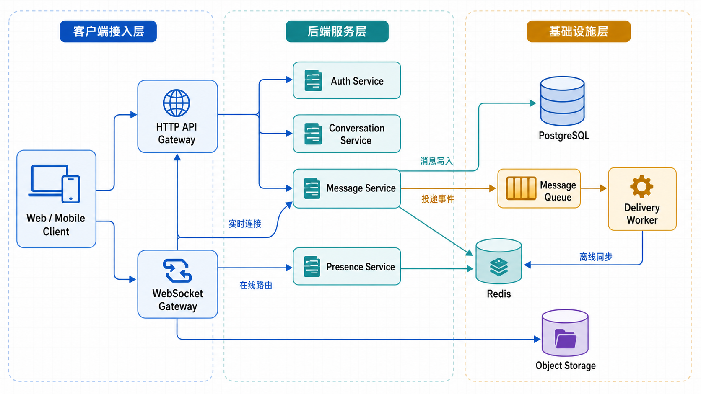
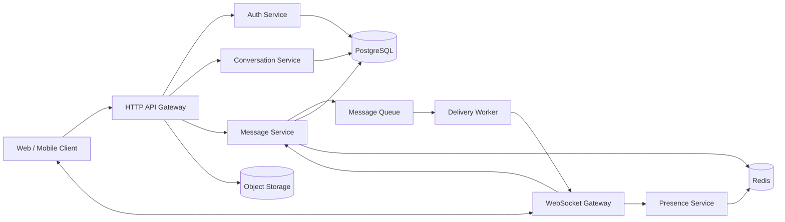
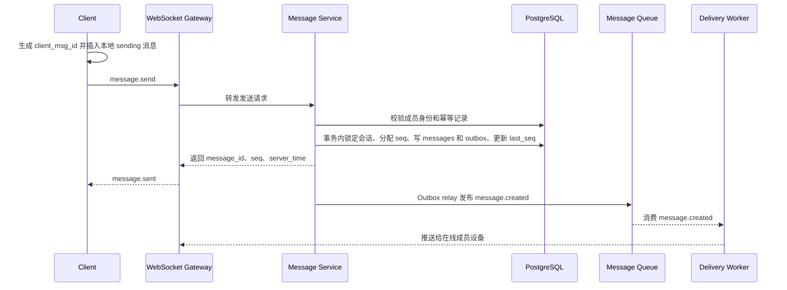

# IM 聊天系统设计文档

## 1. 背景与目标

本文设计一个面向通用社交与协作场景的 IM 聊天系统，适合作为 `lingxi-chat`
后续产品化与工程实现的系统蓝图。当前仓库是 TanStack Start + React 应用，
本文只做系统设计，不包含代码实现。

首版目标：

- 支持账号登录、多端登录、好友/联系人、单聊、群聊和文本消息。
- 支持历史消息拉取、离线同步、未读数、会话级已读位置、单聊已读回执、消息撤回。
- 保证消息“不丢失、可重试、可补偿同步”，并在会话内保持有序。
- 支持中小规模部署：万级 DAU、百级到千级并发长连接、后续可水平扩展。
- 为大群、搜索、推送通知、风控、音视频等能力保留扩展边界。

非目标：

- 首版不做音视频通话、端到端加密、跨地域多活、机器人开放平台。
- 首版不追求所有设备实时强一致，离线同步负责最终补齐。
- 首版不做复杂内容审核和推荐算法，只预留事件与扩展点。

## 2. 产品范围与用户场景

### 2.1 MVP 产品闭环

首版必须让用户完成“找人聊天”的完整闭环：登录后能找到联系人，建立单聊或小群，在会话列表看到最新消息与未读提醒，进入会话发送和接收消息，断线或换设备后能补齐遗漏消息。

MVP 必做：

- 用户资料：展示昵称、头像、账号标识，允许后续扩展个人资料编辑。
- 好友/联系人：搜索用户、发送好友申请、同意或拒绝申请、查看联系人列表。
- 单聊：从联系人发起单聊；双方已有单聊时复用原会话，不重复创建。
- 群聊：选择联系人创建群聊，邀请成员，成员主动退出；首版不做管理员体系扩展。
- 消息：首版只做文本消息；图片和文件进入第二阶段，通过上传凭证与资源引用实现。
- 会话列表：按最新活跃时间排序，展示头像、标题、最新消息摘要、时间、未读数、置顶、免打扰。
- 通知：Web 前台实时提示和未读红点必做；移动端系统 Push 不进入首版，以离线同步保证回到应用后可补齐。

MVP 不做：群公告、群禁言、群转让、入群审批、黑名单、举报后台、消息编辑、引用回复、表情回应、语音消息、全局消息搜索、联系人推荐、复杂在线状态。

### 2.2 核心用户场景

- 新用户登录后通过昵称或账号 ID 搜索用户，发送好友申请，对方同意后双方进入联系人列表。
- 用户从联系人页发起单聊；如果单聊已存在，直接进入原会话并保留历史消息。
- 用户选择多个联系人创建群聊，创建者默认是群主，成员能看到自己入群后的新消息。
- 用户打开会话列表时，能看到置顶会话优先、普通会话按最新消息时间倒序、免打扰会话不触发强提醒但保留未读数。
- 用户进入会话并阅读到最新消息后，该会话未读数清零，多端同步已读位置。
- 用户弱网发送失败时看到失败状态，可手动重试；重试不会生成重复消息。
- 用户离线期间收到消息，重新打开应用后能补齐消息并看到正确未读数。

### 2.3 单聊与群聊产品边界

- 单聊只有两名成员，不能主动添加第三人；需要多人沟通时创建新群聊。
- 单聊会话不可退出，删除会话只影响个人列表视图，再次发消息时恢复展示。
- 群聊首版上限 500 人，群主仅负责创建、邀请和移除成员；管理员、转让、禁言后续再做。
- 群成员退出后不再收到新消息，但保留退出前可见历史；删除会话只影响个人列表视图，不删除全局消息。
- 系统消息用于展示创建群、邀请、退出、撤回等事件，默认计入历史，但不计入未读数。


## 3. 关键设计原则

- 消息先落库再投递，避免服务崩溃导致消息丢失。
- 客户端生成 `client_msg_id` 做发送幂等，服务端生成会话内单调递增 `seq` 做同步游标。
- WebSocket 负责实时双向通道，HTTP 负责登录、会话管理、历史拉取、上传凭证等稳定请求。
- 会话元信息、成员状态、消息明细拆开存储，避免热点字段和大表互相拖累。
- 在线投递只做尽力实时，可靠性由数据库消息、同步游标和客户端补偿共同保证。
- 业务层不吞异常，权限、幂等、事务失败要显式返回错误并让调用方处理。

## 4. 需求假设

本文按以下默认假设设计，后续可根据真实产品目标调整：

- 用户规模：首版万级 DAU，后续可扩到百万级注册用户。
- 消息规模：平均每个活跃用户每天 50 条消息，峰值按平均值 10 倍估算。
- 群规模：普通群上限 500 人，大群能力后续单独设计。
- 多端：同一用户允许 Web、iOS、Android、小程序等多设备同时在线。
- 一致性：会话内消息严格按 `seq` 展示；跨会话不保证全局顺序。
- 数据保留：普通消息长期保留，用户删除会话默认只影响个人视图。

## 5. 总体架构

下图是基于本节 Mermaid 架构定义生成的系统总览图，便于在阅读文档或评审方案时快速理解核心模块关系：





模块职责：

- 客户端：维护本地消息状态机，处理发送中、已发送、失败、重试、离线同步和乱序展示。
- HTTP API Gateway：统一鉴权、限流、请求路由、错误响应和审计日志。
- WebSocket Gateway：负责长连接、握手鉴权、心跳、连接路由和协议事件转发。
- Auth Service：账号登录、设备会话、token 签发、刷新与吊销。
- Conversation Service：单聊/群聊、成员、置顶、免打扰、已读位置和会话列表。
- Message Service：消息写入、幂等检查、`seq` 分配、历史拉取、撤回和同步游标。
- Delivery Worker：消费消息事件，按在线路由投递到用户设备。
- Presence Service：在线状态、设备状态、最后活跃时间。
- Object Storage：保存图片、文件等大对象，消息表只保存资源引用和元数据。

## 6. 领域模型

### 6.1 用户与设备

- `users(id, nickname, avatar_url, status, created_at, updated_at)`
- `devices(id, user_id, platform, device_name, push_token, last_seen_at)`
- `sessions(id, user_id, device_id, token_hash, expires_at, revoked_at)`

说明：

- `devices` 用于区分同一用户不同终端，支持多端在线和设备级推送。
- `sessions` 保存登录态，支持退出单设备、全端退出和 token 吊销。

### 6.2 联系人与好友关系

- `friend_requests(id, requester_id, addressee_id, message, status, created_at, handled_at)`
- `friendships(user_id, friend_user_id, remark, status, created_at, updated_at)`

说明：

- 好友关系按双向联系人展示，但可以用两条 `friendships` 记录保存各自备注和删除状态。
- 只有双方已建立好友关系时，才允许从联系人页直接发起单聊；临时会话或陌生人消息不进入首版。
- 好友删除只影响联系人入口，不强制删除既有单聊历史。


### 6.3 会话与成员

- `conversations(id, type, title, avatar_url, owner_id, last_message_id, last_seq, created_at, updated_at)`
- `conversation_members(conversation_id, user_id, role, joined_seq, left_seq, joined_at, muted_until, pinned_at, last_read_seq, deleted_at)`

说明：

- `type` 包含 `direct`、`group`。
- 单聊会话使用两名成员归一化后的业务 key 保证唯一。
- 群成员退出后，默认不能看到退出后的新消息，但保留退出前可见历史。
- 历史可见性使用 `joined_seq` 与 `left_seq` 判断，避免按时间戳比较导致边界消息归属不一致。
- `last_read_seq` 是用户维度，不是设备维度，符合大多数 IM 产品的已读习惯。

### 6.4 消息

- `messages(id, conversation_id, sender_id, client_msg_id, seq, type, content, status, created_at, edited_at, recalled_at)`
- 唯一索引：`(sender_id, client_msg_id)`，用于发送重试幂等。
- 唯一索引：`(conversation_id, seq)`，用于会话内有序同步。

说明：

- `type` 包含 `text`、`image`、`file`、`system`。
- `content` 使用 JSON 保存类型化内容，例如文本正文、文件名、大小、mime、对象存储 key、宽高等。
- `status` 首版包含 `normal`、`recalled`，编辑消息可在后续通过版本表扩展。

### 6.5 投递与同步游标

- `message_outbox(id, message_id, conversation_id, seq, event_type, payload, status, retry_count, next_retry_at, created_at)`
- `device_message_acks(device_id, conversation_id, last_acked_seq, updated_at)`
- `message_delivery_logs(message_id, user_id, device_id, status, error_code, updated_at)`

说明：

- `message_outbox` 与消息写入处于同一数据库事务，作为 MQ 发布的唯一事件源，避免消息已提交但投递事件丢失。
- `device_message_acks` 用于诊断设备级漏推和断线补偿，不作为展示未读的唯一来源。
- `message_delivery_logs` 可以先按需采样或只记录失败，避免首版写放大。

## 7. 核心链路设计

### 7.1 发送消息



关键点：

1. 客户端发送超时后必须复用同一个 `client_msg_id` 重试。
2. 服务端如果命中 `(sender_id, client_msg_id)` 唯一索引，直接返回原消息，不能重新分配 `seq` 或写 outbox。
3. 消息写入、会话 `last_seq` 更新和 outbox 写入必须在同一事务内完成。
4. `seq` 分配通过锁定 `conversations` 行或独立 seq 行执行 `last_seq + 1`，并依赖 `(conversation_id, seq)` 唯一索引兜底。
5. MQ 发布由 outbox relay 在事务提交后异步执行，发送接口不直接依赖 MQ 可用性；relay 失败时按 `retry_count` 和 `next_retry_at` 重试，超过阈值进入死信并告警。

### 7.2 接收与 ACK

1. Delivery Worker 根据 Redis 中的在线路由找到目标用户设备。
2. WebSocket Gateway 推送 `message.new`。
3. 客户端写入本地消息库后返回 `message.ack`。
4. 服务端更新设备级 `last_acked_seq` 或写入投递日志。
5. 如果客户端未 ACK，不影响消息已发送状态，重连后通过同步补齐。

### 7.3 离线同步

1. 客户端保存每个会话本地最大 `seq`。
2. WebSocket 重连或应用启动后，客户端调用同步接口。
3. 服务端按 `conversation_id + after_seq` 返回缺失消息。
4. 客户端发现 `seq` 不连续时继续分页拉取，直到无缺口。

推荐接口：

- `GET /conversations/{id}/messages?after_seq=100&limit=50`
- `GET /sync/conversations?cursor=...`，用于批量同步会话列表和最新游标。

### 7.4 已读与未读

- 客户端进入会话并展示到某条消息后，上报 `conversation.read`。
- 服务端只允许 `last_read_seq` 单调递增，禁止回退。
- 未读数优先按成员可见范围内 `seq > last_read_seq` 的消息数计算；只有不存在入群前、离群后和不可见消息时，才能退化为 `conversations.last_seq - conversation_members.last_read_seq`。
- 系统消息和撤回态消息进入历史记录，但不计入未读数。

### 7.5 撤回消息

1. 客户端调用 `POST /messages/{id}/recall`。
2. 服务端校验发送者身份、撤回时间窗口、会话成员身份。
3. 服务端更新 `messages.status = recalled` 和 `recalled_at`。
4. 服务端发布 `message.recalled` 事件，在线端实时替换展示。
5. 离线端后续同步时看到消息状态并修正本地展示。

### 7.6 客户端本地消息模型与状态机

客户端本地消息至少保存 `local_id`、`conversation_id`、`client_msg_id`、`message_id`、`sender_id`、`seq`、`type`、`content`、`local_status`、`server_time`、`created_at`、`updated_at`、`error_code`。`local_id` 只用于本地渲染，`client_msg_id` 用于发送幂等，`message_id` 与 `seq` 由服务端返回后回填。

发送方本地状态机：

- `draft`：仅本地草稿，不参与同步。
- `uploading`：图片/文件正在上传对象存储，仅附件消息使用。
- `sending`：消息已进入发送队列，等待服务端确认。
- `sent`：服务端已落库并返回 `message_id`、`seq`。
- `failed`：上传失败、鉴权失败、无权限、内容非法或重试耗尽。
- `recalled`：服务端撤回成功或收到撤回事件。

允许状态流转：`draft -> uploading -> sending -> sent -> recalled`，文本消息可跳过 `uploading`；`uploading`、`sending` 可进入 `failed`；`failed` 只能使用原 `client_msg_id` 重试回到 `uploading` 或 `sending`。客户端不得因为 WebSocket 断线直接把 `sending` 改为 `failed`，只能标记为待重试。

### 7.7 发送队列、重试与幂等

客户端按会话维护发送队列，同一会话内按本地创建顺序串行发送；不同会话可以并行。发送请求超时、连接断开或收到可重试错误时，使用同一个 `client_msg_id` 指数退避重试，用户手动重试也必须复用原 `client_msg_id`。收到 `message.sent` 或 HTTP 发送响应后，用 `client_msg_id` 匹配本地消息并回填服务端字段；如果先收到自己的 `message.new`，也按 `client_msg_id` 合并，不新增重复气泡。

服务端错误分为：

- 可重试：`TIMEOUT`、`RATE_LIMITED`、`SERVER_BUSY`、`INTERNAL_ERROR`。
- 不可重试：`UNAUTHORIZED`、`FORBIDDEN`、`CONVERSATION_NOT_FOUND`、`CONTENT_INVALID`、`UPLOAD_NOT_FOUND`。

不可重试错误直接进入 `failed` 并展示失败原因；可重试错误保留在发送队列，达到客户端重试上限后进入 `failed`。

### 7.8 重连补偿、排序与缺口检测

客户端为每个会话持久化 `last_contiguous_seq` 与本地已存在的最大 `seq`。消息展示只按 `seq ASC` 排序；本机未确认的 `sending` 消息没有 `seq`，展示在对应会话底部，并在服务端确认后合并到真实位置。

收到 `message.new` 时按以下规则处理：

1. `seq <= last_contiguous_seq`：按 `message_id` 或 `(conversation_id, seq)` 去重后忽略重复事件。
2. `seq == last_contiguous_seq + 1`：写入本地库并推进 `last_contiguous_seq`。
3. `seq > last_contiguous_seq + 1`：先写入本地库，标记会话存在缺口，立即发起 `sync.request` 或 HTTP `after_seq=last_contiguous_seq` 补齐。

重连成功后，客户端必须对会话列表返回的每个 `last_seq > last_contiguous_seq` 的会话发起补偿同步。同步结果按 `seq` 合并，直到没有缺口再清除缺口标记；如果单次 `limit` 不足，继续分页拉取。

### 7.9 附件上传与发送

本节为第二阶段图片/文件消息设计，第一阶段不阻塞文本消息上线。图片/文件消息先调用 `POST /uploads/presign` 获取上传凭证，再由客户端直传对象存储。上传完成后发送消息，`content` 必须包含 `object_key`、`file_name`、`size`、`mime_type`，图片还需包含 `width`、`height`、`thumbnail_key`。消息服务只接受已完成且属于当前发送者的 `object_key`。

附件本地状态由上传状态和消息状态共同决定：上传失败停留在 `failed`，用户重试时重新获取上传凭证；发送失败但上传已成功时，重试发送消息即可，不应重复上传同一个文件。

### 7.10 未读、已读与多端同步

客户端进入会话并展示到最新连续消息后，上报 `POST /conversations/{id}/read` 或 `conversation.read`，字段为 `conversation_id`、`last_read_seq`、`client_time`。`last_read_seq` 只能单调递增，服务端忽略小于等于当前值的上报。

多端登录时，任一设备上报已读后，服务端向该用户其他在线设备推送 `conversation.updated`，包含新的 `last_read_seq` 与 `unread_count`。客户端收到后更新会话列表未读数，但不强制改变当前设备的滚动位置。其他设备发送的新消息也会推送给当前设备；如果 `sender_id` 是当前用户，客户端按 `client_msg_id` 或 `message_id` 与本地发送记录合并。

## 8. API 与协议设计

### 8.1 HTTP API

- `POST /auth/login`：登录并返回 access token、refresh token、设备信息。
- `POST /auth/refresh`：刷新 access token。

- `GET /users/search`：按账号 ID 或昵称搜索用户。
- `GET /contacts`：获取联系人列表。
- `POST /friend-requests`：发送好友申请。
- `GET /friend-requests`：获取待处理好友申请。
- `POST /friend-requests/{id}/accept`：同意好友申请。
- `POST /friend-requests/{id}/reject`：拒绝好友申请。
- `GET /conversations`：获取会话列表，包含最新消息、未读数、成员摘要。
- `POST /conversations/direct`：创建或获取单聊会话。
- `POST /conversations/group`：创建群聊。
- `POST /conversations/{id}/members`：邀请群成员。
- `DELETE /conversations/{id}/members/{user_id}`：移除群成员或退出群聊。
- `GET /conversations/{id}/messages`：按 `before_seq` 或 `after_seq` 分页拉取历史。
- `POST /messages`：发送消息，作为 WebSocket 发送的 HTTP 兜底通道。
- `POST /messages/{id}/recall`：撤回消息。
- `POST /conversations/{id}/read`：上报已读位置。

- `POST /conversations/{id}/pin`：置顶或取消置顶会话。
- `POST /conversations/{id}/mute`：设置或取消会话免打扰。
- `DELETE /conversations/{id}`：删除个人会话列表入口，不删除全局消息。
- `POST /uploads/presign`：获取对象存储上传凭证。

### 8.2 WebSocket 连接

连接地址：

```text
wss://host/ws?ticket=<one_time_ticket>&device_id=<device_id>
```

`ticket` 由已鉴权 HTTP 接口签发，短期有效且一次性使用，避免长期 access token 出现在 URL、代理日志或浏览器历史中。

客户端事件：

- `ping`：心跳。
- `message.send`：发送消息。
- `message.ack`：确认设备收到消息。
- `conversation.read`：上报已读位置。
- `sync.request`：请求按会话游标补偿消息。

服务端事件：

- `pong`：心跳响应。
- `message.sent`：发送结果。
- `message.new`：新消息推送。
- `message.recalled`：消息撤回通知。
- `conversation.updated`：会话元信息变化。
- `presence.changed`：在线状态变化。
- `error`：协议级错误。

### 8.3 会话列表与通知契约

- `GET /conversations` 默认返回当前用户未删除的会话，置顶会话在前，其余按 `last_message.created_at` 倒序。
- 最新消息摘要按消息类型生成：文本显示正文截断，图片显示“[图片]”，文件显示“[文件] 文件名”，撤回显示“消息已撤回”。
- 免打扰会话仍累计未读数，但不触发声音、桌面通知或强弹窗。
- Web 端在线时收到 `message.new` 后更新会话列表、未读数和页签标题；当前打开会话收到新消息时不增加该会话未读。
- 移动端系统 Push 只保留 `devices.push_token` 和事件扩展点，不纳入首版验收。


### 8.4 消息发送事件格式

```json
{
  "event": "message.send",
  "request_id": "req_01H...",
  "payload": {
    "conversation_id": "c_123",
    "client_msg_id": "local_1700000000_abc",
    "type": "text",
    "content": {
      "text": "你好"
    }
  }
}
```

服务端成功响应：

```json
{
  "event": "message.sent",
  "request_id": "req_01H...",
  "payload": {
    "message_id": "m_123",
    "conversation_id": "c_123",
    "client_msg_id": "local_1700000000_abc",
    "seq": 101,
    "server_time": "2026-05-12T04:00:00.000Z"
  }
}
```

### 8.5 服务端推送、ACK 与错误格式

`message.new` 必须携带完整渲染所需字段，避免客户端再按消息 ID 二次查询：

```json
{
  "event": "message.new",
  "request_id": "req_01H...",
  "payload": {
    "message_id": "m_123",
    "conversation_id": "c_123",
    "client_msg_id": "local_1700000000_abc",
    "sender_id": "u_123",
    "seq": 101,
    "type": "text",
    "content": { "text": "你好" },
    "status": "normal",
    "server_time": "2026-05-12T04:00:00.000Z"
  }
}
```

客户端持久化后回传：

```json
{
  "event": "message.ack",
  "request_id": "req_01H...",
  "payload": {
    "conversation_id": "c_123",
    "message_id": "m_123",
    "seq": 101
  }
}
```

错误事件统一包含 `code`、`message`、`retryable` 和原始 `request_id`。客户端只根据 `code` 与 `retryable` 决定重试和本地状态，不解析自然语言 `message`。

## 9. 存储设计

### 9.1 PostgreSQL

PostgreSQL 作为首版主存储，保存用户、会话、成员、消息和游标。

推荐索引：

- `messages(conversation_id, seq desc)`：历史消息分页。
- `messages(sender_id, client_msg_id)`：发送幂等。
- `conversation_members(user_id, deleted_at, pinned_at, conversation_id)`：用户会话列表。
- `conversation_members(conversation_id, user_id)`：成员身份校验。
- `message_outbox(status, next_retry_at, id)`：投递事件扫描和重试。
- `device_message_acks(device_id, conversation_id)`：设备级 ACK 游标更新。
- `conversations(updated_at desc)`：后台管理或运营查询。

消息表增长后再引入：

- 按时间或 `conversation_id` 分区。
- 冷热数据分层，近期消息留主库，历史归档到对象存储或分析库。
- 大群消息单独优化，避免单会话热点写入拖垮普通会话。

### 9.2 Redis

Redis 保存短生命周期状态：

- 在线路由：`user_id -> device_id -> gateway_id -> connection_id`，设置短 TTL 并由心跳续期。
- WebSocket 心跳状态和最后活跃时间。
- 热点会话未读缓存。
- 接口限流计数。
- 短期发送去重缓存，但数据库唯一索引仍是最终幂等保障。

Redis 中的数据都不应是唯一可信来源，重启或丢失后必须能从数据库恢复。

### 9.3 消息队列

首版建议使用 Redis Stream 或 RabbitMQ，满足简单投递、重试和消费确认。队列语义按至少一次投递设计，Delivery Worker 必须用 `message_id` 或 `message_outbox.id` 幂等消费，重复事件只允许重复推送同一条消息，不能重复写库或推进错误游标。

当出现以下情况时迁移 Kafka：

- 消息吞吐持续增长，单 Redis Stream 难以支撑。
- 需要多消费者订阅消息事件，例如搜索索引、风控、通知、数据分析。
- 需要更强的消息保留、回放和消费组治理能力。

### 9.4 对象存储

对象存储在第二阶段启用，图片和文件采用直传：

1. 客户端请求 `POST /uploads/presign`。
2. 服务端校验权限、文件大小、mime 类型，返回短期上传凭证。
3. 客户端直传对象存储。
4. 客户端发送图片或文件消息，消息内容只保存对象 key 与元数据。

## 10. 一致性与可靠性

### 10.1 顺序保证

- 服务端只保证单会话内顺序，不保证全局消息顺序。
- `seq` 必须由服务端分配，客户端时间不能参与最终排序。
- 客户端收到乱序消息时先持久化，再按 `seq` 展示。
- 客户端发现缺口时触发同步，不依赖 WebSocket 自动重推。

### 10.2 幂等保证

- 客户端每次用户发送动作生成一个稳定 `client_msg_id`。
- 超时、断网、重连后的同一条消息必须复用原 `client_msg_id`。
- 服务端以 `(sender_id, client_msg_id)` 作为最终幂等键。
- 幂等命中时必须返回原始消息内容、`message_id`、`seq` 和 `server_time`；如果请求体内容与原消息不一致，应返回幂等冲突错误，避免同一个 `client_msg_id` 覆盖不同消息。

### 10.3 失败处理

- 服务端写库失败：发送失败，客户端保留失败状态并允许重试。
- 写库成功但响应丢失：客户端重试后命中幂等记录，拿到原 `message_id` 和 `seq`。
- Outbox relay 投递失败：发送接口已成功但 outbox 仍为待发布或重试状态，relay 恢复后继续发布，超过阈值进入死信并告警。
- WebSocket 推送失败：消息仍可通过离线同步补齐。
- Redis 路由丢失：只影响实时性，不影响最终消息可达。

## 11. 安全与权限

- HTTP 请求必须校验 access token；WebSocket 使用短期一次性 `ticket` 完成握手鉴权，握手成功后绑定 `user_id` 与 `device_id`。
- 发送、拉取、撤回、已读上报、成员邀请、上传凭证签发都必须校验会话成员身份。
- 群管理接口校验角色权限，例如 owner、admin、member；普通成员不能执行踢人、转让、修改群配置等管理操作。
- 客户端传入的 `conversation_id`、`message_id`、`object_key` 只能作为索引条件，服务端必须二次校验资源归属，避免越权读取其他会话消息或文件。
- 文件上传凭证必须限制文件大小、mime 类型、扩展名、过期时间和目标路径；对象存储桶默认私有，下载也经鉴权后签发短期 URL。
- 上传完成后校验对象大小、mime 与消息元数据一致；文件名展示前转义，图片只允许安全格式，后续如开放公网分享需增加病毒扫描。
- 文本消息入库前限制长度，展示用户内容、富文本或链接预览时必须防 XSS，禁止直接插入用户 HTML。
- 登录、发送消息、创建群聊、上传凭证、历史同步接口需要用户级、设备级和 IP 级限流；超限返回稳定错误码并记录安全日志。
- 登录、登出、token 刷新、撤回消息、群成员变更、上传凭证签发、权限拒绝和限流命中必须写审计日志，审计日志至少保留 180 天。
- 敏感日志不能记录 token、完整文件签名 URL 或用户隐私明文。

## 12. 部署方案

首版进程：

- `web-app`：当前 React 前端应用。
- `api-server`：HTTP API、鉴权、会话管理和消息写入。
- `ws-gateway`：WebSocket 长连接服务。
- `delivery-worker`：消息投递消费者。
- `postgres`：主数据库。
- `redis`：在线路由、缓存、限流。
- `object-storage`：第二阶段启用，用于图片和文件存储。

中小规模可以先把 `api-server`、`ws-gateway`、`delivery-worker` 部署在同一服务仓库中，
但运行时建议拆成独立进程，便于分别扩容。

扩容策略：

- `api-server` 无状态扩容。
- `ws-gateway` 按连接数水平扩容，在线路由写 Redis。
- `delivery-worker` 按队列堆积和消费延迟扩容；跨网关投递时先查 Redis 路由，再通过 Redis Stream 转发到目标 `gateway_id` 对应的网关消费流。
- PostgreSQL 先做索引和分区，后续再考虑读写分离或消息库拆分。

## 13. 可观测性

核心指标：

- WebSocket 在线连接数、连接建立失败率、重连率、心跳超时数、单连接消息下发速率。
- 消息发送成功率、幂等命中率、写入延迟、端到端投递延迟 P95/P99、ACK 延迟 P95/P99。
- MQ 堆积长度、消费延迟、重试次数、死信数量、投递失败数。
- 离线同步请求量、单次同步消息数、同步缺口大小、同步失败率。
- 数据库慢查询、消息表写入 TPS、事务冲突数、连接池使用率、Redis 内存和命中率。
- 对象存储上传凭证签发量、上传失败率、文件大小分布、下载鉴权失败数。

告警建议：

- 消息发送成功率连续 5 分钟低于 99% 或端到端投递延迟 P99 超过 5 秒。
- MQ 消费延迟连续 5 分钟超过 30 秒，或死信数量非零。
- WebSocket 握手失败率、心跳超时率、重连率较过去 7 天同时间段基线翻倍。
- 数据库连接池使用率超过 80%、慢查询突增、Redis 内存超过 80% 或 key 淘汰非零。
- 登录失败、权限拒绝、限流命中、上传鉴权失败在短时间内异常增长。

关键日志字段：

- `request_id`
- `user_id`
- `device_id`
- `conversation_id`
- `message_id`
- `client_msg_id`
- `gateway_id`
- `connection_id`
- `error_code`

链路追踪建议：

- 发送消息链路从客户端请求开始，到消息落库、MQ 发布、Worker 消费、WebSocket 推送结束。
- 每个阶段记录耗时和失败原因，用于定位重复发送、漏推、乱序、同步缺口和越权访问问题。

## 14. 测试与验收策略

产品验收口径：

- 账号与联系人：用户能登录、搜索另一个用户、发送好友申请；对方同意后双方联系人列表都出现对方。
- 单聊：从联系人进入单聊，发送文本后双方实时可见；重复发起同一联系人单聊不会创建第二个单聊会话。
- 群聊：选择至少 2 个联系人创建群聊，成员能收发文本消息；退出群聊后不再收到新消息。
- 会话列表：新消息能把会话提升到列表顶部；置顶会话始终位于普通会话之前；免打扰会话保留未读但不触发强提醒。
- 未读与已读：离开会话后收到消息会增加未读；进入会话并读到最新消息后未读清零，另一在线设备能同步已读位置。
- 弱网重试：发送超时后用户看到发送中或失败状态，点击重试后只产生一条服务端消息。
- 离线补偿：接收方离线期间的消息在重新打开应用后能补齐，消息顺序与发送顺序一致。
- 撤回：发送者在允许窗口内撤回后，所有在线端替换为撤回态，离线端同步后也显示撤回态。


单元测试：

- `client_msg_id` 幂等逻辑。
- 成员权限校验。
- 会话 `seq` 分配。
- 已读位置单调递增。
- 撤回时间窗口和权限。

集成测试：

- 发送消息成功后能写库、更新会话、发布投递事件。
- 服务端响应丢失后重试不会生成重复消息。
- WebSocket 断线后按 `after_seq` 能补齐缺失消息。
- 群成员退出后不能收到退出后的新消息。
- 文件消息只能引用已授权上传的对象 key。

压测场景：

- 多用户并发发送单聊消息。
- 一个群内连续高频发送消息。
- 大量设备同时重连并触发离线同步。
- WebSocket Gateway 水平扩容后的路由投递。

验收标准：

- 单会话内消息展示顺序与服务端 `seq` 一致。
- 发送超时重试不会产生重复消息。
- 客户端离线后重新上线能补齐缺失消息。
- 用户无权访问非成员会话消息。
- 服务端重启后，在线路由可重建，历史消息不丢失。

安全与运维验收：

- 权限验收：非会话成员不能发送、拉取、撤回消息或下载会话文件；普通群成员不能执行管理员操作。
- XSS 验收：文本消息、文件名、链接预览字段注入脚本时不得执行。
- 上传验收：超大文件、伪造 mime、非法扩展名、过期上传凭证和未授权 `object_key` 必须被拒绝。
- 限流验收：登录、发消息、建群、上传凭证和历史同步达到阈值后返回稳定错误码，不产生数据库写入放大。
- 运维验收：MQ 堆积、Worker 停止、Redis 不可用、WebSocket 网关重启、数据库主从切换均有告警，并能通过同步链路恢复消息可达。
- 备份恢复验收：PostgreSQL 开启 PITR 备份，至少每日全量备份与连续 WAL 归档；从备份恢复到指定时间点后，消息 `seq`、会话 `last_seq`、成员 `last_read_seq` 与审计日志可交叉校验。

故障演练至少每个发布周期执行一次：停止 `delivery-worker` 观察 MQ 堆积与恢复；重启 `ws-gateway` 验证重连和补偿同步；模拟 Redis 不可用验证失败、告警和恢复；恢复一份数据库备份验证 RPO/RTO 是否满足上线要求。

## 15. 迭代路线

第一阶段：账号登录、好友/联系人、单聊、群聊、文本消息、WebSocket 推送、历史拉取、会话列表、未读数、会话级已读位置、单聊已读回执、消息撤回、置顶、免打扰、Web 前台通知。

第二阶段：图片/文件消息、对象存储直传、离线同步补偿增强。

第三阶段：消息搜索、群管理增强、设备管理、移动端系统 Push、投递链路监控面板。

第四阶段：消息表分区、Kafka 事件总线、热点群优化、冷热归档、多区域容灾。

## 16. 主要风险与取舍

- 未读数实时精确会增加查询成本，首版按成员可见范围计算；只有简单会话可退化为 `last_seq - last_read_seq`，缓存只做加速。
- WebSocket 推送不作为可靠性的唯一来源，可靠性由消息落库、outbox 和离线同步兜底。
- Redis Stream 或 RabbitMQ 首版更容易落地，但长期吞吐和生态不如 Kafka。
- 单库消息表实现最快，但消息增长后必须分区、归档或拆库。
- 用户维度已读会牺牲设备级独立已读，但符合通用社交产品习惯。
- 大群的 fanout 写放大和在线推送压力较大，首版限制群规模更稳妥。

## 17. 已确认的产品与架构决策

以下决策已经确认，后续研发拆分和接口设计按本节执行。

### 17.1 消息可靠性等级

选择：**最终可达，不承诺所有设备实时强一致**。

消息落库后即可认为发送成功，实时推送失败由 outbox、ACK 诊断和离线同步补齐；不等待所有目标设备 ACK 后再确认发送成功。

### 17.2 群规模上限

选择：**首版普通群 500 人以内**。

首版使用普通 fanout 推送和成员可见范围计算；超过 500 人的大群能力后续单独设计，不进入首版。

### 17.3 已读回执粒度

选择：**会话级已读位置 + 单聊已读回执**。

所有会话维护 `last_read_seq`；单聊可以展示对方是否已读，群聊不展示每条消息的已读成员列表。

### 17.4 历史消息删除与退群可见性

选择：**个人删除，不删除全局消息；退群后保留退出前可见历史**。

删除会话只隐藏个人会话入口，不删除消息表；用户再次收到消息或重新发起会话时可恢复展示。群成员退出后不能看到退出后的新消息，但保留退出前可见历史。

### 17.5 系统消息与撤回消息未读口径

选择：**系统消息和撤回态消息都不计入未读数**。

系统消息和撤回事件进入历史记录，用于同步会话状态和展示事件，但不增加红点和未读数。

### 17.6 图片和文件消息排期

选择：**图片和文件消息进入第二阶段**。

首版只实现文本消息，图片/文件相关的数据模型、上传凭证、对象存储直传和安全校验保留设计，但不阻塞第一阶段上线。

### 17.7 跨 WebSocket Gateway 投递方案

选择：**Redis Stream**。

`delivery-worker` 查 Redis 在线路由后，将跨网关投递事件写入目标 `gateway_id` 对应的 Redis Stream，目标 `ws-gateway` 消费后推送本机连接。

### 17.8 文件安全策略

选择：**基础校验**。

第二阶段实现文件消息时，先做大小、mime、扩展名、私有桶、短期上传凭证和短期下载 URL 校验；病毒扫描仅在开放公网分享或高风险附件类型时引入。

### 17.9 端到端加密

选择：**首版不做端到端加密，只做传输加密和服务端权限控制**。

服务端保留搜索、审核、风控、备份和排障能力；端到端加密后续作为独立专项评估。

### 17.10 技术栈拆分方式

选择：**单仓库内模块化，运行时拆进程**。

当前项目早期阶段优先单仓库模块化开发，运行时拆分 `api-server`、`ws-gateway`、`delivery-worker` 进程；不做过早微服务拆分。

## 18. 落地开发准入结论

当前文档已经可以作为首版研发拆分输入，用于拆分产品、前端客户端、后端服务、测试、安全和运维任务；不建议再停留在宏观系统设计阶段。

进入编码前需要把以下内容固化为开发任务或接口附录：

- 输出数据库 DDL 或迁移脚本，明确字段类型、唯一索引、分页索引和 outbox 状态枚举。
- 输出 HTTP API schema、WebSocket 事件 schema、错误码表和鉴权 ticket 签发接口。
- 输出 Redis Stream 跨 `ws-gateway` 投递的 stream 命名、消息格式、消费组、超时和重试策略。
- 结合压测结果确定限流阈值、告警阈值、SLO/SLA、RPO/RTO。

## 19. 推荐结论

首版建议采用“单区域、模块化单体后端、独立 WebSocket Gateway、PostgreSQL
主存储、Redis 在线路由、Redis Stream 或 RabbitMQ 投递队列、对象存储直传”的方案。

这个方案的核心取舍是：把可靠性放在消息落库、outbox、幂等和离线同步上，把实时性作为可恢复的体验优化。
它能支撑早期 IM 产品快速落地，同时为消息表分区、Kafka、大群优化、多区域容灾留下清晰演进路径。
